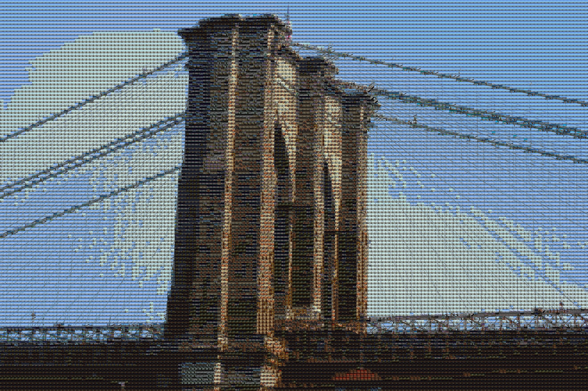

# Azure Functions Photo Mosaic Generator

Use Azure Functions and [Microsoft Cognitive Services Custom Vision Service](https://azure.microsoft.com/en-us/services/cognitive-services/custom-vision-service/) to generate a photo mosaic from an input image.

For example, you can train your model with NYC landmarks. Custom Vision will recognize an image of the Brooklyn Bridge, and the function will create a photo mosaic composed of Bing image search results for "Brooklyn Bridge." See examples below.

**Original**

**Mosaic**
